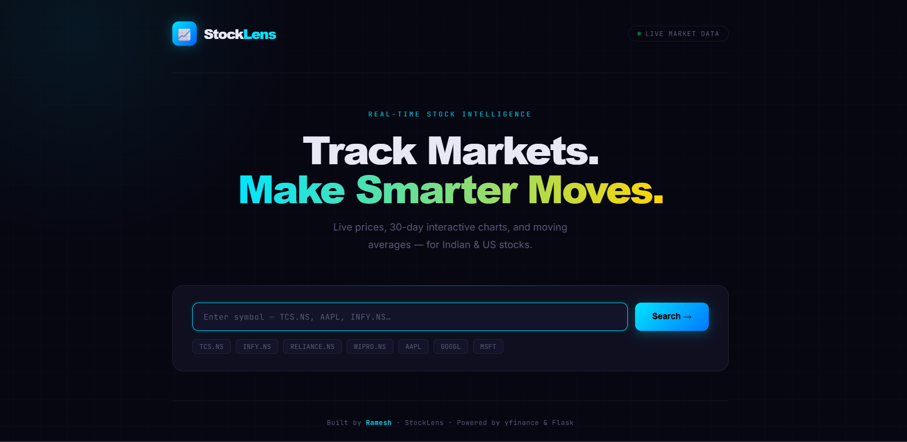

| [📈 StockLens](https://github.com/rameshgehlot76/stock-price-tracker) 🌐 [Live](https://stocklens-qbtn.onrender.com) | Real-time stock tracker with interactive charts & moving averages | Python, Flask, yfinance, Plotly, pandas |


A clean, production-ready stock market tracker built with Flask and Python. Get real-time prices, interactive 30-day charts, and 7-day moving averages for any Indian or US stock — right in your browser.

## 🌐 Live Demo

👉 **[View Live App →](https://stocklens-qbtn.onrender.com)**

> ⚠️ First load may take 30 seconds — free hosting wakes up on first visit.

---

## 🖥️ Preview

> Search any stock symbol → Get live price, day high/low, prev close, change % and an interactive chart instantly.

 

---

## ✨ Features

- 🔴 **Live stock prices** — Indian (NSE) and US stocks
- 📊 **Interactive 30-day chart** with 7-Day Moving Average
- 📉 **Price change** with absolute and percentage values
- ⚡ **Loading spinner** — smooth UX while fetching data
- 🛡️ **Error handling** — clean messages for invalid symbols
- 📱 **Fully responsive** — works on mobile, tablet and desktop
- 🎨 **Premium dark UI** — Cabinet Grotesk + Inter + JetBrains Mono fonts

---

## 🛠️ Tech Stack

| Layer | Technology |
|---|---|
| Backend | Python, Flask |
| Data | yfinance (Yahoo Finance API) |
| Charts | Plotly |
| Data Processing | pandas |
| Frontend | HTML, CSS, Jinja2 |
| Fonts | Cabinet Grotesk, Inter, JetBrains Mono |

---

## 🚀 Run Locally

### 1. Clone the repo
```bash
git clone https://github.com/rameshgehlot76/stock-price-tracker.git
cd stock-price-tracker
```

### 2. Create virtual environment
```bash
python -m venv venv
venv\Scripts\activate        # Windows
source venv/bin/activate     # Mac/Linux
```

### 3. Install dependencies
```bash
pip install -r requirements.txt
```

### 4. Run the app
```bash
python app.py
```

### 5. Open in browser
```
http://127.0.0.1:5000
```

---

## 📦 Project Structure

```
stock-price-tracker/
│
├── app.py              # Flask backend & routes
├── stock_data.py       # yfinance data fetching & Plotly chart
├── requirements.txt    # Python dependencies
├── templates/
│   └── index.html      # Frontend UI (Jinja2)
└── README.md
```

---

## 🔍 Stock Symbol Guide

| Company | Symbol |
|---|---|
| TCS | `TCS.NS` |
| Infosys | `INFY.NS` |
| Reliance | `RELIANCE.NS` |
| Wipro | `WIPRO.NS` |
| Apple | `AAPL` |
| Google | `GOOGL` |
| Microsoft | `MSFT` |

> For Indian stocks listed on NSE, add `.NS` after the symbol.

---

## 📚 What I Learned

- Fetching and processing real-time financial data using **yfinance**
- Building **RESTful routes** with Flask (GET/POST)
- Creating **interactive data visualizations** with Plotly
- Handling **API edge cases** and missing data gracefully
- Building a **responsive dark UI** with pure CSS

---

## 👨‍💻 Author

**Ramesh**
- GitHub: [@rameshgehlot76](https://github.com/rameshgehlot76)

---

> ⭐ If you found this useful, consider starring the repo!


